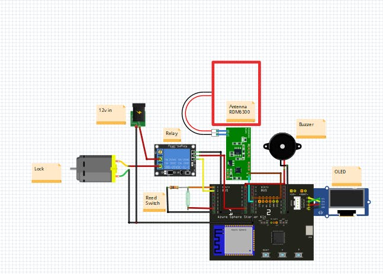

# Azure Sphere Code
## Made as part of the "Secure Everything" Hackster.io competition for the Azure Sphere.
### Full instructions over at the [competition submission](https://www.hackster.io/lock-and-load/azure-sphere-iot-enabled-rfid-lock-e73f70)



[Video 1: User Auth](https://youtu.be/Nx61jQrMt5E)

[Video 2: Remote Open](https://youtu.be/xl0Ke_jWDBY)


This door lock uses an RFID scanner to authorise users, with onboarding and offboarding users being dealt with by an accompanying webapp. This door lock gives visual feedback through an OLED screen and audio feedback through a buzzer. This door lock works even without the internet as users information is stored locally within the Azure Spheres mutable storage.

# Setup
I'd suggest you read the [competition submission](https://www.hackster.io/lock-and-load/azure-sphere-iot-enabled-rfid-lock-e73f70) for a full set of instructions.
* Modify ```connection_strings.h.``` to include your Azure IOT Hub device connection string.
* Modify ```app.json``` to include the Fully Qualified Domain Name (FQDN) of your Azure IOT Hub.

if you see ```[Azure IoT Hub client] INFO: connection to the IoT Hub has been established (IOTHUB_CLIENT_CONNECTION_OK)``` appear in the debug window, then your Azure connection is working fine


